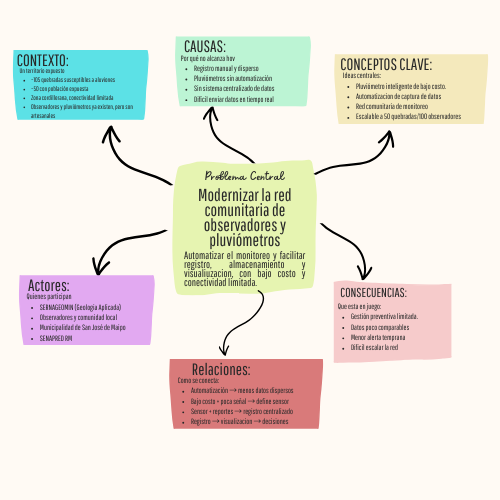
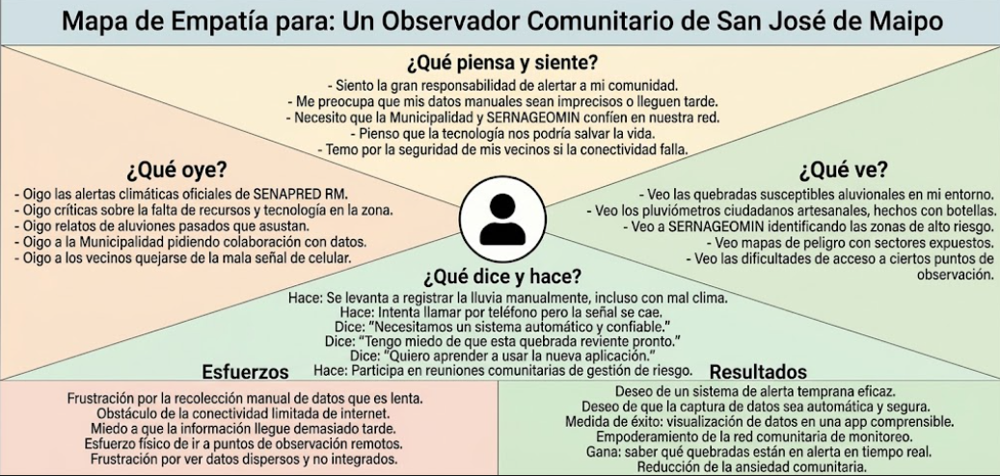

# S02 - Comprensión del problema y Design Thinking

**Fecha:** 27-08-2026  
**Participantes:** BENJAMÍN JARPA, SEBASTIÁN MEDALLA, CÉSAR OLIVARES, PABLO TRONCOSO

**Responsable del registro:** CÉSAR OLIVARES

## Objetivo

Comprender y definir el problema de aluviones y monitoreo comunitario en San José de Maipo utilizando herramientas de Design Thinking (mapa conceptual y mapa de empatía), y practicar técnicas de comunicación oral efectiva mediante un pitch.

## Actividades realizadas

1. Revisión y discusión del desafío del proyecto: “Modernizar la red comunitaria de monitoreo de precipitaciones y riesgo aluvional en San José de Maipo mediante el diseño de un prototipo de bajo costo…”. 
2. Construcción de un **mapa conceptual** del problema, identificando:
   - Actores involucrados (observadores, comunidad, municipalidad, SERNAGEOMIN, SENAPRED). 
   - Causas o factores que influyen (lluvias intensas, características de las quebradas, conectividad limitada, registro manual de datos).
   - Consecuencias o impactos (riesgo para la población, dificultad para la alerta temprana, información dispersa).
   - Contexto en que ocurre (comuna de San José de Maipo, zonas de quebradas vulnerables).
   - Conceptos importantes (red comunitaria, pluviómetros ciudadanos, gestión del riesgo, alerta temprana).
   - Relaciones entre los distintos elementos.
3. Identificación de **lo que sabemos** y **lo que no sabemos** sobre el problema, a partir del mapa conceptual y del documento base. 
4. Construcción de un **mapa de empatía** para entender a las personas afectadas por el problema (observadores, habitantes de sectores expuestos) y definir al usuario principal de la solución.
5. Revisión de técnicas de **comunicación oral efectiva** (planificación, realización y evaluación).
6. Elaboración y presentación de un **pitch** sobre un tema relacionado al proyecto, para poner en práctica lo aprendido en comunicación oral.

## Evidencias

  

  

## Resultados

- Se logró una comprensión compartida del problema, pasando de una idea general (“aluviones en San José de Maipo”) a una definición más clara y estructurada, que incluye actores, causas, consecuencias y contexto.
- El mapa conceptual permitió visualizar cómo se relacionan:
  - Las quebradas y la exposición de la población.
  - La existencia de observadores y pluviómetros artesanales.
  - La limitación de conectividad y el registro manual de datos.
  - La necesidad de una solución de bajo costo que automatice parte del monitoreo.
- El mapa de empatía ayudó a:
  - Identificar al usuario principal (observador comunitario / habitante de sector expuesto).
  - Reconocer sus necesidades (información clara, alertas oportunas, herramientas simples de usar).
  - Entender sus frustraciones (datos que no se aprovechan, falta de integración con autoridades).
- En el pitch, el equipo practicó:
  - Planificar el mensaje (estructura, tiempo, ideas clave).
  - Realizar la exposición con claridad y seguridad.

## Decisiones y justificación

| Decisión | Evidencia o criterio | Consecuencia para el proyecto |
|---|---|---|
| Usar Design Thinking como marco metodológico para todo el proyecto | Consenso del equipo y alineación con el tipo de desafío (solución tecnológica y social centrada en el usuario) | Todas las siguientes sesiones se organizarán en torno a las fases de empatizar, definir, idear, prototipar y testear. |
| Definir al observador comunitario / habitante de sector expuesto como usuario principal | Resultados del mapa de empatía y del mapa conceptual | El diseño de la solución (hardware, software, alertas) se orientará a sus necesidades, capacidades y contexto. |
| Priorizar la comprensión del problema antes de proponer soluciones técnicas | Necesidad de evitar sesgos y asegurar que la solución responda a necesidades reales | Las próximas sesiones se enfocarán en profundizar la empatía y la definición del problema antes de idear y prototipar. |

## Errores, dificultades o riesgos

- Al inicio, hubo cierta confusión entre “red comunitaria” y “municipalidad”, lo que dificultaba definir claramente al usuario.
  - Por qué creemos que ocurrió: el documento base menciona varios actores (observadores, municipalidad, SERNAGEOMIN, SENAPRED) y no estaba explícito quién es el usuario principal. 
  - Qué haremos para comprobarlo o corregirlo: usar el mapa de empatía y validar con el equipo que el foco está en los observadores y habitantes expuestos, sin descartar a las instituciones como usuarios secundarios.
- Riesgo de avanzar demasiado rápido hacia lo técnico (sensores, app) sin tener suficiente claridad sobre el contexto y las necesidades reales.
  - Qué haremos: mantener la disciplina de Design Thinking: no pasar a idear/prototipar hasta tener una definición del problema compartida y basada en evidencia. 

## Aprendizajes

- El equipo ahora entiende que el problema no es solo “falta de tecnología”, sino un problema sociotécnico: cómo hacer que la información sea útil, usable y usada por la comunidad y las instituciones.
- Se comprendió mejor la diferencia entre:
  - **Actores** (todos los que participan o son afectados).
  - **Usuarios principales** (quienes usarán directamente la solución).
  - **Beneficiarios** (quienes se benefician indirectamente).
- Se aprendió que herramientas visuales como el mapa conceptual y el mapa de empatía ayudan a:
  - Ordenar ideas.
  - Identificar vacíos de información.
  - Alinear la comprensión del problema entre todos los integrantes. 
- En comunicación oral, el equipo entendió la importancia de:
  - Planificar el pitch (estructura, tiempo, mensaje clave).
  - Adaptar el lenguaje al público.
  - Cerrar con una idea fuerza clara.

## Tareas y responsables

| Tarea | Responsable(s) | Fecha límite | Estado |
|---|---|---|---|
| Digitalizar y subir el mapa conceptual al repositorio | CÉSAR OLIVARES | 28-08-2026 | Completado |
| Digitalizar y subir el mapa de empatía al repositorio | CÉSAR OLIVARES | 28-08-2026 | Completado |
| Sintetizar “lo que sabemos” y “lo que no sabemos” en un documento breve | BENJAMÍN JARPA, SEBASTIÁN MEDALLA, CÉSAR OLIVARES, PABLO TRONCOSO | 02-09-2026 | Pendiente |

## Próximo paso

La siguiente acción es **profundizar la fase de empatía** del Design Thinking, respondiendo las preguntas identificadas como “lo que no sabemos” y avanzando en la definición detallada del usuario y su contexto.  
La evidencia de que resultó será:
- Un mapa de empatía más detallado (o varios, si se distinguen distintos tipos de usuarios).
- Una definición del problema (punto de vista) redactada y compartida en el equipo.

## Fuentes consultadas

