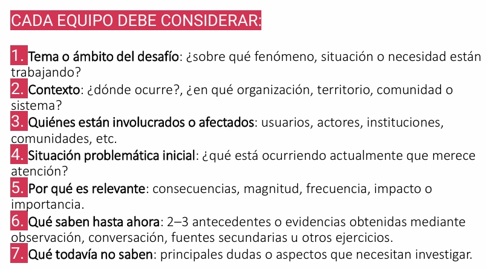

# S05 - Construcción del pitch y profundización del problema

**Fecha:** 10-09-2026  
**Participantes:** BENJAMÍN JARPA, SEBASTIÁN MEDALLA, CÉSAR OLIVARES, PABLO TRONCOSO 

**Responsable del registro:** CÉSAR OLIVARES

## Objetivo

Comprender los elementos principales de un pitch y aplicarlos en la elaboración de una presentación breve para el proyecto PluvioTech. Además, profundizar en la comprensión del problema mediante preguntas orientadoras y evaluar el desempeño individual y grupal de los integrantes.

## Actividades realizadas

1. Revisión de los elementos que componen un pitch efectivo, considerando la presentación del problema, las personas afectadas, la importancia de resolverlo y la propuesta de solución.
2. Elaboración colaborativa de un pitch para el proyecto PluvioTech.
3. Selección de uno de los integrantes del equipo como representante para presentar oralmente el pitch.
4. Análisis del problema mediante las siguientes preguntas orientadoras:
   - ¿Qué está ocurriendo?
   - ¿A quién le ocurre?
   - ¿Por qué importa?
   - ¿Qué sabemos?
   - ¿Qué creemos, pero aún no sabemos?
   - ¿Qué necesitamos averiguar y todavía no sabemos?
5. Elaboración de respuestas preliminares para cada una de las preguntas, con el objetivo de diferenciar la información conocida, los supuestos y los vacíos de información.
6. Realización de una autoevaluación individual y una evaluación de los integrantes del equipo, considerando su participación y desempeño durante el trabajo.

## Evidencias

[Documento con las respuestas a las preguntas orientadoras](../Documentos/PreguntasCapstone.pdf)

## Resultados

- Se identificaron los elementos principales que debe contener un pitch para comunicar un proyecto de manera clara y breve.
- El equipo elaboró un pitch para PluvioTech, orientado a explicar el problema de los aluviones y la necesidad de modernizar el monitoreo comunitario en San José de Maipo.
- Se definió a un integrante como representante para presentar el discurso frente al curso o grupo de trabajo.
- Las preguntas orientadoras permitieron ordenar la información disponible sobre el desafío:
  - **Qué está ocurriendo:** San José de Maipo tiene numerosas quebradas propensas a aluviones en masa tras
  eventos de lluvia. Existe una red comunitaria de observadores y pluviómetros artesanales, pero los datos se registran de forma manual, dispersa y poco integrada
  - **A quién le ocurre:** Al observador comunitario / habitante de un sector expuesto a quebradas de aluvión en San José de Maipo
  - **Por qué importa:** El monitoreo actual no puede escalar de forma sostenible a más quebradas ni observadores.
  - **Qué sabemos:** Existe una necesidad de automatizar parte del monitoreo, integrar datos instrumentales con reportes ciudadanos y considerar la conectividad limitada del territorio.
  - **Qué creemos, pero aún no sabemos:** Que es posible implementar sensores y comunicación básica en condiciones de conectividad limitada.
  - **Qué necesitamos averiguar:** Se requiere conocer las necesidades concretas de los usuarios, las condiciones de conectividad, los protocolos de alerta existentes, los sensores más adecuados y los requisitos de las instituciones involucradas.
- La autoevaluación y evaluación grupal permitieron identificar fortalezas y aspectos de mejora relacionados con la comunicación, participación, responsabilidad y colaboración del equipo.

## Decisiones y justificación

| Decisión | Evidencia o criterio | Consecuencia para el proyecto |
|---|---|---|
| Utilizar un pitch para comunicar el proyecto PluvioTech | El pitch permite presentar de forma breve el problema, su importancia y la solución propuesta | El equipo podrá explicar el proyecto de manera más clara ante docentes, instituciones y posibles colaboradores |
| Organizar el pitch a partir del problema, los usuarios y la solución | Las preguntas trabajadas ayudaron a ordenar la información y distinguir hechos de supuestos | La propuesta se enfocará primero en las necesidades de las personas y no únicamente en la tecnología |
| Mantener como usuario principal a la comunidad y a los observadores locales, considerando a las instituciones como actores relevantes | El problema afecta directamente a personas que viven o trabajan en sectores expuestos | El diseño deberá considerar facilidad de uso, comprensión de las alertas y condiciones reales de conectividad |
| Diferenciar lo que se sabe de lo que todavía debe investigarse | Se identificaron vacíos de información sobre usuarios, conectividad, sensores y protocolos de alerta | Las siguientes actividades deberán enfocarse en obtener evidencia y validar los supuestos |
| Realizar autoevaluación y evaluación entre integrantes | La evaluación permite reconocer el desempeño individual y mejorar la colaboración | Se podrán ajustar responsabilidades y formas de trabajo para las próximas sesiones |

## Errores, dificultades o riesgos

- Al construir el pitch, pudo resultar difícil resumir un problema amplio y técnico en un mensaje breve y comprensible.
- Existe el riesgo de presentar como hechos algunos aspectos que todavía son supuestos, especialmente las necesidades de los usuarios y la disposición de la comunidad a utilizar la solución.
- La información disponible sobre las condiciones reales de conectividad, los protocolos de alerta y el funcionamiento de los observadores comunitarios aún es limitada.
- Para corregir estas dificultades, se deberán validar las respuestas mediante investigación documental, contacto con instituciones y, si es posible, entrevistas o consultas a usuarios relacionados con el problema.

## Aprendizajes

- Un pitch debe comunicar de manera breve y ordenada el problema, las personas afectadas, la importancia de resolverlo y la propuesta de solución.
- No toda la información considerada por el equipo tiene el mismo nivel de certeza; es necesario distinguir entre datos comprobados, creencias y preguntas pendientes.
- Las preguntas orientadoras ayudan a profundizar la fase de empatía y definición del Design Thinking.
- La solución no debe diseñarse únicamente desde el punto de vista técnico, sino considerando la experiencia y las necesidades de los usuarios.
- La autoevaluación y la evaluación entre pares permiten reconocer el aporte de cada integrante y detectar oportunidades de mejora en el trabajo colaborativo.

## Tareas y responsables

| Tarea | Responsable(s) | Fecha límite | Estado |
|---|---|---|---|
| Organizar y subir al repositorio el pitch y sus evidencias | CÉSAR OLIVARES | 18-09-2026 | Pendiente |
| Investigar las condiciones de conectividad y monitoreo en San José de Maipo | SEBASTIÁN MEDALLA, PABLO TRONCOSO | 18-09-2026 | Pendiente |
| Identificar instituciones o personas que puedan aportar información sobre el problema | BENJAMÍN JARPA | 18-09-2026 | Pendiente |

## Próximo paso

El próximo paso será validar los supuestos identificados durante la sesión y profundizar en las necesidades de los usuarios y actores involucrados. Para ello, el equipo deberá investigar documentos disponibles, buscar posibles contactos institucionales y revisar las condiciones técnicas y sociales de la solución.

La evidencia esperada será:

- Un documento que diferencie hechos, supuestos y preguntas pendientes.
- Un registro de fuentes o contactos consultados.
- Una definición más precisa del usuario y del problema.

## Fuentes consultadas

- SERNAGEOMIN, “Modernización de la Red Comunitaria de Observadores y Pluviómetros Ciudadanos para la Gestión del Riesgo
de Aluviones en San José de Maipo”, documento base del proyecto.
- Material de clases sobre elaboración y presentación de pitch.
- Material de clases sobre Design Thinking, comprensión del problema y definición de usuarios.
- Pauta de autoevaluación y evaluación del trabajo en equipo.